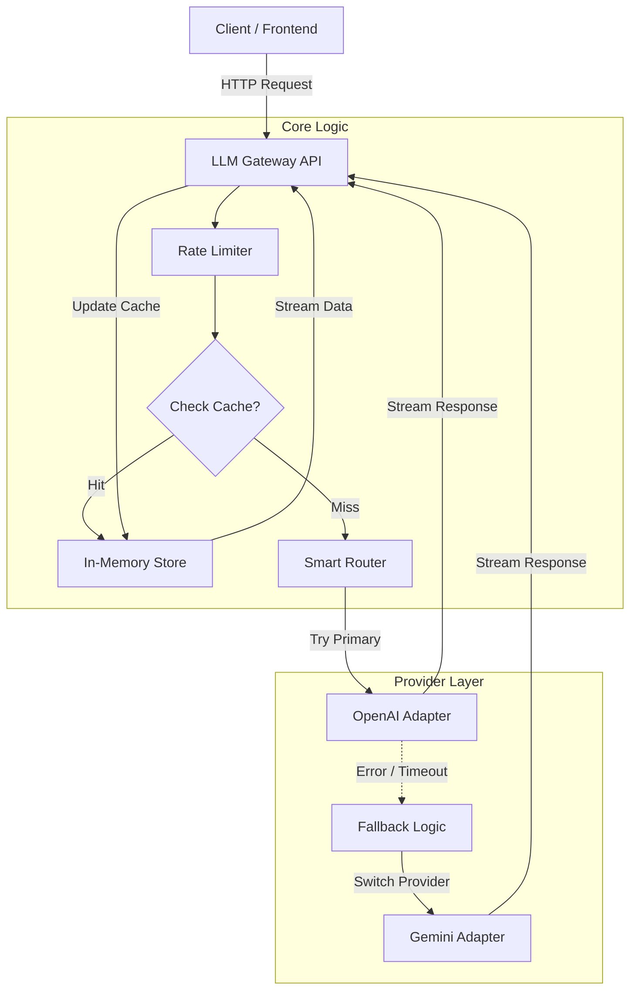

# LLM Gateway

A production-ready API gateway for LLM providers (OpenAI, Gemini) with streaming, caching, rate limiting, and automatic fallback.

## Architecture



## Features

- **Unified API** – Single endpoint for chat and streaming; supports OpenAI (gpt-4o-mini) and Google Gemini (gemini-1.5-flash).
- **Smart fallback** – Tries OpenAI first, falls back to Gemini on error or timeout.
- **Streaming** – Token-by-token responses via Server-Sent Events (SSE).
- **Caching** – In-memory cache with TTL; cache hits are streamed back for consistent UX.
- **Rate limiting** – 5 requests per minute per IP (configurable); returns 429 when exceeded.
- **Structured logging** – Request ID, truncated prompt, provider, cache hit, latency, status (Pino).
- **Docker** – Dockerfile and Docker Compose for deployment.

## Prerequisites

- Node.js 20+
- API keys: [OpenAI](https://platform.openai.com/api-keys) and/or [Google AI (Gemini)](https://aistudio.google.com/app/apikey)

## Setup

1. **Clone and install**

   ```bash
   npm install
   ```

2. **Environment**

   Copy `.env.example` to `.env` and set your keys:

   ```bash
   cp .env.example .env
   ```

   Required (at least one):

   - `OPENAI_API_KEY` – for OpenAI
   - `GEMINI_API_KEY` – for Gemini

   Optional: `PORT`, `HOST`, `LOG_LEVEL`, `LOG_PRETTY=1`, `NODE_ENV`

3. **Build and run**

   ```bash
   npm run build
   npm start
   ```

   Or for development with watch:

   ```bash
   npm run dev
   ```

   Server listens on `http://0.0.0.0:3000` by default.

## Docker

```bash
# Ensure .env exists with your API keys, then:
docker compose up --build
```

- **Dockerfile** – Node 20 Alpine, build and run production server.
- **docker-compose.yml** – Service `llm-gateway`, port 3000, `env_file: .env`, `restart: on-failure`.

## API

| Method | Path              | Description                    |
|--------|-------------------|--------------------------------|
| POST   | `/api/chat`       | Non-streaming chat; returns full JSON response. |
| GET    | `/api/chat/stream`| Streaming chat (SSE). Query: `prompt=...` or `message=...`. |
| POST   | `/api/chat/stream`| Streaming chat (SSE). Body: `{ "message": "..." }`. |

**Example – streaming (GET)**

```bash
curl -N "http://localhost:3000/api/chat/stream?prompt=Hello"
```

**Example – streaming (POST)**

```bash
curl -N -X POST http://localhost:3000/api/chat/stream \
  -H "Content-Type: application/json" \
  -d '{"message": "Hello"}'
```

**Example – non-streaming**

```bash
curl -X POST http://localhost:3000/api/chat \
  -H "Content-Type: application/json" \
  -d '{"message": "Hello"}'
```

## Scripts

| Script              | Description                          |
|---------------------|--------------------------------------|
| `npm run dev`       | Run with tsx watch (development).   |
| `npm run build`     | Compile TypeScript to `dist/`.      |
| `npm start`         | Run production server.              |
| `npm run test:rate-limit` | Send 6 requests; 6th should get 429. |

## License

ISC
# LLM-Gateway
